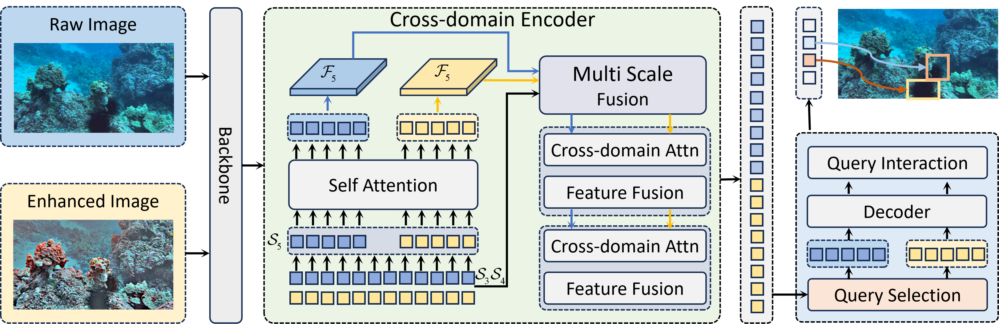

# UCF-DETR

## Introuduction

## Benchmark
- **DUO**(https://github.com/chongweiliu/DUO)
- **UDD**(https://github.com/chongweiliu/UDD_Official.git)

## Performance
| Model   | Backbone | Epochs | Dataset | $AP^{val}$ | $AP_{50}^{val}$ | $AP_{75}^{val}$ |  FPS  | URL  |
| :------ | :------- | :----- | :------- | :--------- | :-------------- | :--------------| :---- |----: |
| UCF-DETR | ResNet50 | 12     | DUO    | 66.4       | 85.5            | 73.9            | 18.9  |[ckpt](https://pan.baidu.com/s/1TmrW_JBEQw_ayHRWcmS3KQ?pwd=qt4f)/[logs](https://github.com/bibabu555/UCF-DETR/blob/main/dataset/DUO.txt)  |
| UCF-DETR | ResNet50 | 12     | UDD    | 51.7       | 78.8            | 60.2            | 18.9  |[ckpt](https://pan.baidu.com/s/1TmrW_JBEQw_ayHRWcmS3KQ?pwd=qt4f)/[logs](https://github.com/bibabu555/UCF-DETR/blob/main/dataset/UDD.txt)  |

### Feature Map

### Complex Scenarios

## Install
The code is built on [RT-DETR](https://github.com/lyuwenyu/RT-DETR.git)
